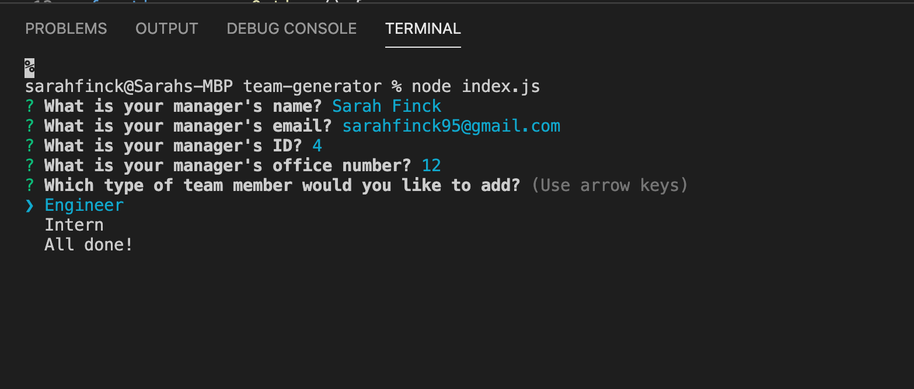
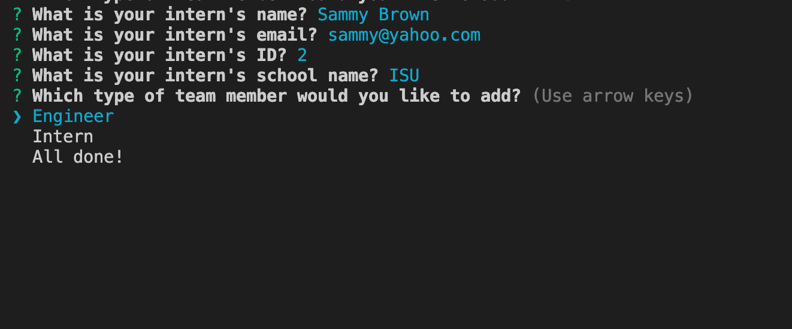
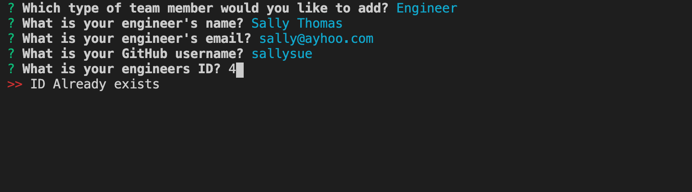
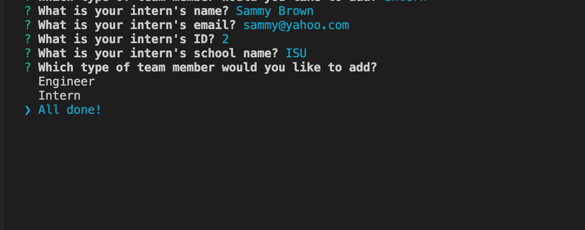

# team-generator


## Description 
The Team Generator applicaiton is designed for the user to build a team of developers. They have the option of choosing a manager, engineers and interns. When the user adds a manager option they are required to give the name, id, email and office number. When the user adds an engineer, they are required to give the name, id, email and git hub username. When the user adds an intern, they are required to give the name, id, email and school name. The user is allowed to add as many engineers and interns as they would like. When they are completed with their team they have an option to choose 'All Done!', which will terminate the application. Once the data is collected, it is generated into an HTML file where it displays each team member in a separate card with their inputted information. In addition to adding the text to the html, it will display an icon that will represent what role the team member has. 

## Table of Contents
* [Installation](#installation)
* [Usage](#usage)
* [License](#license)

## Installation 
1. [JavaScript](https://www.javascript.com/) 
2. [Node](https://nodejs.org/en/)
3. [Inquirer package](https://www.npmjs.com/package/inquirer)
4. [fs](https://www.npmjs.com/package/fs)
5. [Path](https://www.npmjs.com/package/path)
6. [Screencastify](https://www.screencastify.com/)
7. [Font Awesome](https://fontawesome.com/)

## Usage 
The user will run 'node index.js' and they will be prompted with the following questions: 


Next, the user will choose which team member they want to add:


If the user tries to enter a previous ID then "ID already exists" message will appear:


Once the user is completed with their team, the application will end and the index.html will open and display their team: 


## User Story

```md
AS A manager
I WANT to generate a webpage that displays my team's basic info
SO THAT I have quick access to their emails and GitHub profiles
```

## Acceptance Criteria

```md
GIVEN a command-line application that accepts user input
WHEN I am prompted for my team members and their information
THEN an HTML file is generated that displays a nicely formatted team roster based on user input
WHEN I click on an email address in the HTML
THEN my default email program opens and populates the TO field of the email with the address
WHEN I click on the GitHub username
THEN that GitHub profile opens in a new tab
WHEN I start the application
THEN I am prompted to enter the team manager’s name, employee ID, email address, and office number
WHEN I enter the team manager’s name, employee ID, email address, and office number
THEN I am presented with a menu with the option to add an engineer or an intern or to finish building my team
WHEN I select the engineer option
THEN I am prompted to enter the engineer’s name, ID, email, and GitHub username, and I am taken back to the menu
WHEN I select the intern option
THEN I am prompted to enter the intern’s name, ID, email, and school, and I am taken back to the menu
WHEN I decide to finish building my team
THEN I exit the application, and the HTML is generated
```

## License 
[MIT](https://opensource.org/licenses/MIT)